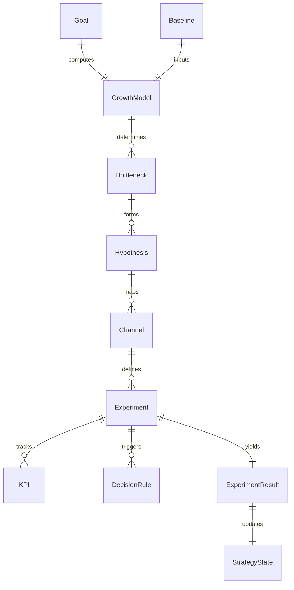

# Strategy Contract Specification

Unified interface schema. All modules must adhere to strict type-checked parameters.

## Input Contract
All engines accept a JSON payload compliant with the GTM strategy input schemas:
- Goal
- Baseline (Optional, must fallback to Gate 4 warning if missing)
- ResourceConstraints
- ICP & Persona data

## Output Contract
Every pipeline run generates a single cohesive `StrategyReport` containing:
- `strategy_id`
- `goal`
- `hypotheses`
- `channels`
- `experiments`
- `kpis`
- `timeline`
- `decision_rules`

## Internal Data Model

