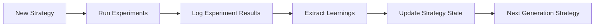

# Strategy Memory Specification

Mechanisms to persist strategy state and history. Prevent re-running failed experiments.

## Memory Cycle

## Structure
Memory stores state in `schemas/strategy-state.json`. 
Updates evaluate:
- **Winning Patterns**: Add tactics/audiences where outcome = SCALE.
- **Failed Patterns**: Add tactics/audiences where outcome = KILL.
- **Rules**: If a channel is in `failed_patterns`, channel score is penalized (default: -50%).
