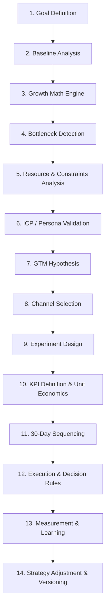

# GTM Strategy Pipeline Specification

Backbone pipeline. Sequenced steps. Structured inputs to structured outputs. No loose intermediate steps.

## Pipeline Diagram

## Phase Descriptions

### Phase 1: Goal Definition
Parse user intent. Extract `target`, `metric`, `target_value`, `deadline`, and `constraints`. Validate inputs.

### Phase 2: Baseline Analysis
Gather actual historical metrics. Compute conversion rates across funnel: Reach → Lead → Meeting → Opportunity → Customer.

### Phase 3: Growth Math Engine
Deterministic backward-calculation. 
Formula:
$$\text{Required Opportunities} = \frac{\text{Target Customers}}{\text{Opp-to-Customer Rate}}$$
$$\text{Required Meetings} = \frac{\text{Required Opportunities}}{\text{Meeting-to-Opp Rate}}$$
$$\text{Required Leads} = \frac{\text{Required Meetings}}{\text{Lead-to-Meeting Rate}}$$

### Phase 4: Bottleneck Detection
Assess constraints. Rank lowest performing funnel stages based on historical vs. benchmark gaps. Focus strategy here.

### Phase 5: Resource & Constraints Analysis
Examine budget, team hours, and sales/marketing capacity to determine maximum execution limits.

### Phase 6: ICP / Persona Validation
Map targets to segment triggers and pain points. Combine with competitor intel threats.

### Phase 7: GTM Hypothesis
Draft conditional GTM hypotheses. Format: `If we target [ICP] via [Channel] with [Tactic] focusing on [Pain/Trigger], then we can generate [Target Value] [Metric] within [Duration] at [Cost].`

### Phase 8: Channel Selection
Score channels configuration-driven. Match channel funnel contribution to the identified bottleneck.

### Phase 9: Experiment Design
Map scored channels to structured experiments with explicit dependencies and status tracking.

### Phase 10: KPI Definition & Unit Economics
Select Leading and Lagging indicators. Calculate baseline LTV, CAC, Payback Period, and Channel ROI.

### Phase 11: 30-Day Sequencing
Weekly structured action plan based on dependencies. Focus on validation first, then testing, doubling down, and scaling/deciding.

### Phase 12: Execution & Decision Rules
Condition-action rules mapping experiment outputs to KILL, ITERATE, PIVOT, CONTINUE, or SCALE.

### Phase 13: Measurement & Learning
Compare actual vs. target metrics. Calculate learning confidence based on sample size.

### Phase 14: Strategy Adjustment & Versioning
Commit state updates. Increment version (e.g. v1 -> v2) and document explicit reason for change in version ledger.
