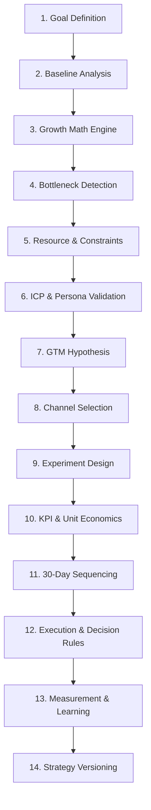

# GTM Strategy Skill: End-to-End Walkthrough

This document guides you through the execution pipeline of the GTM Strategy Skill, demonstrating how a raw business outcome goal is converted into a structured, measurable, and executable growth system.

---

## 1. Pipeline Execution Flow

The skill follows a rigid 14-stage workflow to prevent hallucination, generic recommendations, or unfeasible plans:



---

## 2. Interactive Execution: Step-by-Step

### Step 1: Goal Definition & Quality Gates
**Input:**
```json
{
  "goal_id": "GOAL-001",
  "target": "Acquire 20 new paying customers",
  "metric": "paying_customers",
  "target_value": 20,
  "deadline": "30 days"
}
```
*Verification Check:* The system runs Quality Gates 1 & 2. If the goal was "grow fast" or lacked a deadline, it would fail immediately with `Insufficient Information`.

### Step 2: Funnel Baseline & Bottleneck Detection
**Input:**
```json
{
  "traffic": 1000,
  "leads": 100,
  "demos": 20,
  "customers": 5
}
```
**Computed Rates (Deterministic):**
* Visitor $\rightarrow$ Lead: **10%**
* Lead $\rightarrow$ Demo: **20%**
* Demo $\rightarrow$ Customer: **25%**

**Bottleneck Analysis:**
The system compares these rates against SaaS benchmarks. If Demo-to-Customer conversion was 5% instead of 25%, it would highlight **Sales Conversion** as the primary bottleneck, shifting subsequent channel strategy from driving traffic to increasing demo quality/sales enablement.

### Step 3: Programmatic Growth Math
CRITICAL: The LLM does not perform math. The system calculates requirements retrograde:
* **Target:** 20 customers
* **Demo-to-Customer Win Rate (25%):** Requires **80 demos**
* **Lead-to-Demo Conversion (20%):** Requires **400 leads**
* **Visitor-to-Lead Conversion (10%):** Requires **4,000 visitors**

### Step 4: Scoring & Channel Selection
Using `config/channel-scoring.yaml`, channels are ranked:
1. **Founder-led Outbound:** Score 88 (High ICP access, fast)
2. **Partnerships:** Score 77 (Strong fit, slower)
3. **Paid Social:** Score 52 (Expensive testing)

### Step 5: Experiment Design & Dependency Mapping
The selected channel is translated into a testable experiment schema:
```json
{
  "experiment_id": "EXP-001",
  "hypothesis_id": "HYP-001",
  "channel": "Founder-led Outbound",
  "audience": "50-500 employee SaaS companies",
  "tactic": "Personalized cold email to VP Marketing",
  "success_metric": "qualified_meeting_rate",
  "threshold": 0.08,
  "duration": "7 days",
  "status": "ready",
  "dependencies": ["HYP-000-ICP-VALIDATION"]
}
```

### Step 6: 30-Day Sequencing & Decision Rules
The calendar is generated dynamically:
* **Week 1:** Setup + ICP List validation.
* **Week 2:** Run experiment `EXP-001`.
* **Week 3:** Apply **Decision Rules**:
  * `IF reply rate > 8%` $\rightarrow$ SCALE volume.
  * `IF reply rate 4-8%` $\rightarrow$ ITERATE messaging.
  * `IF reply rate < 4%` $\rightarrow$ KILL/PIVOT.
* **Week 4:** Update unit economics and document learnings.

---

## 3. Storage & Strategy State Memory

Each iteration is versioned and stored under `schemas/strategy-state.json`. If an experiment fails, the learning is recorded in the memory bank (e.g. "Cold email to VP Marketing yields <2% response"). In future runs, the channel score for that segment is penalized to prevent the model from repeating failed campaigns.
